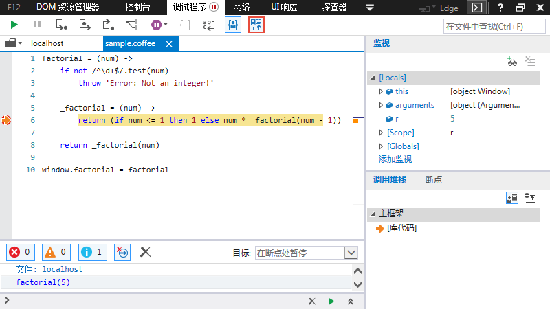

在这个年代，对于前端开发来说，用户浏览器的运行代码和我们写的原始代码已经很不一样了。因为我们的代码一般都要经过压缩、合并，还有的是经过Sass、Less、Stylus、CoffeeScript、TypeScript等语言的预编译。这就使代码调试变得困难重重。

通常JavaScript的解释器会告诉你，第几行第几列代码出错，但这对于转换后的代码毫无用处。举例来说，`jquery-1.11.2.js`压缩后只有3行，每行3万多字符，所有内部变量都改了名字。你看着报错信息，会感到毫无头绪(:晕:)，根本不知道它所对应的原始位置。

SourceMap就是为了解决这个问题而生的。

### 示例

不说废话，先上例子。

首先我们用CoffeeScript写一个阶乘函数，将文件命名为`sample.coffee`：

```coffee
factorial = (num) ->
    if not /^\d+$/.test(num)
        throw 'Error: Not an integer!'

    _factorial = (num) ->
        return (if num <= 1 then 1 else num * _factorial(num - 1))

    return _factorial(num)

window.factorial = factorial
```

然后将代码编译再压缩，会得到`sample.min.js`：

```javascript
(function(){var r;r=function(r){var t;if(!/^\d+$/.test(r))throw"Error: Not an integer!";return(t=function(r){return 1>=r?1:r*t(r-1)})(r)},window.factorial=r}).call(this);
```

当需要调试时，我们的处境就是看着压缩混淆后的JS代码来修改CoffeeScript代码。


当然，对于当前这个例子来说没多大困难，但如果是一个大工程的话，难度就不亚于看着二进制中间码来修改Java代码了。

如果我们有从`sample.coffee`转换到`sample.min.js`对应的SourceMap文件，情况就大不一样。

重新将代码编译再压缩，同时生成`sample.min.map`：

```json
{"version":3,"file":"sample.min.js","sources":["sample.coffee"],"names":["factorial","num","_factorial","test","window"],"mappings":"CAAA,WAAA,GAAAA,EAAAA,GAAY,SAACC,GACZ,GAAAC,EAAA,KAAG,QAAYC,KAAKF,GACnB,KAAM,wBAKP,QAHAC,EAAa,SAACD,GACb,MAAkB,IAAPA,EAAc,EAAOA,EAAMC,EAAWD,EAAM,KAEtCA,IAEnBG,OAAOJ,UAAYA"}
```

然后再打开浏览器的调试工具。

可以发现Sources中能够直接找到`sample.coffee`原始文件，并且可以调试CoffeeScript了耶！


妈妈再也不用担心我调试压缩混淆代码头大了(:QQ:可怜:)。[Demo下载](demo.zip)

### 什么是SourceMap？

> Source maps offer a language-agnostic way of mapping production code to the original code that was authored.
>
> SourceMap提供了一种从生成代码到原始代码的映射方法，并且这种方法与语言无关。


简单来说，SourceMap就是一个信息文件`sample.min.map`，里面储存着代码转换前后对应的位置信息，通常该文件的扩展名是`.map`。

如果要使用SourceMap调试代码，生成代码`sample.min.js`的末尾就必须有如下注释，用于指定SourceMap的路径：

```javascript
//# sourceMappingURL=/path/to/sample.min.map
```

该注释通常由SourceMap的生成工具添加。

也可以在生成代码`sample.min.js`的Response Headers中设置X-SourceMap，来指定SourceMap的路径：

```
X-SourceMap: /path/to/sample.min.map
```

另外也可以使用Date URI的形式来指定SourceMap：

```javascript
//# sourceMappingURL=data:application/json;base64,Asdi...
```

这样调试工具加载转换后的代码，就能找到对应的SourceMap，再根据SourceMap中的信息找到原始代码。从而我们就可以直接用原始代码调试bug和设置断点了。

### 浏览器支持

目前，Chrome、Firefox、Safari和IE11都支持Javascript和CSS的SourceMap了，并且默认都是启用的，你可以用下面的方式确认一下。

#### Chrome

按<key>F12</key>打开Developer Tools，在Setting设置中找到Sources部分，选中`Enable JavaScript source maps`和`Enable CSS source maps`。


#### Firefox

按<key>F12</key>打开Developer Tools，在调试器Tab页的右上角找到调试器选项，选中`显示原始来源`。


#### Safari

我木有Safari。。(:伤不起:)

#### IE11

按<key>F12</key>打开Developer Tools，在调试程序Tab页中先选择对应的JS文件，然后在上方选中`加载已映射到此生成文件的源`。



### SourceMap的生成

#### Closure

最常用的方法是使用Google的[Closure编辑器](https://developers.google.com/closure/compiler)。

生成命令的格式如下：

```shell
$ java -jar compiler.jar --js=sample.js --create_source_map=sample.min.map --source_map_format=V3 --js_output_file=sample.min.js
```

各个参数的意义如下：

- `--js`：转换前的代码文件路径；
- `--create_source_map`：生成的SourceMap文件路径；
- `--source_map_format`：SourceMap的版本，目前一律采用V3；
- `--js_output_file`：转换后的代码文件路径。

#### uglifyjs

uglifyjs是nodejs下的一款优秀的JS压缩优化工具，由于jQuery改用uglifyjs作为其压缩工具令其声名远播，支持SourceMap的生成。

首先安装uglifyjs：

```shell
$ npm install uglify-js -g
```

然后生成命令的格式如下：

```shell
$ uglifyjs sample.js -cm -o sample.min.js --source-map=sample.min.map
```

各个参数的意义如下：

- `-c`：使用压缩器。
- `-m`：使用混淆器。
- `-o`：转换后的代码文件路径。
- `--source-map`：生成的SourceMap文件路径；
- `--source-map-root`：（可选）用于填充SourceMap文件的`sourceRoot`属性。
- `--source-map-url`：（可选）SourceMap的URL路径，用于添加到生成代码的注释`//# sourceMappingURL=`中，默认对应`--source-map`的值；
- `--source-map-include-sources`：（可选）是否将原始代码的内容添加到SourceMap文件的`sourcesContent`属性中。
- `--in-source-map`：（可选）SourceMap输入，如果要压缩的JS是从其他原始代码生成的，就要使用这一项。

#### Less

首先安装Less：

```shell
$ npm install less -g
```

然后生成命令的格式如下：

```shell
$ lessc sample.less sample.css --source-map=sample.css.map
```

各个参数的意义如下：

- `--source-map`：生成的SourceMap文件路径；
- `--source-map-rootpath`：（可选）用于填充SourceMap文件的`sourceRoot`属性。
- `--source-map-inline`：（可选）以Data URI Scheme的形式将SourceMap文件内容内嵌到css文件中。
- `--source-map-url`：（可选）SourceMap的URL路径，用于添加到生成代码的注释`//# sourceMappingURL=`中，默认对应`--source-map`的值。

#### CoffeeScript

生成命令的格式如下：

```shell
$ coffee -cm sample.coffee
```

- `-c`：将CoffeeScript编译成JavaScript。
- `-m`：生成SourceMap文件，后缀为`.js.map`。

可以进一步将生成的代码压缩：

```shell
$ uglifyjs sample.js -cm -o sample.min.js --source-map=sample.min.map --in-source-map=sample.js.map
```

这样就可以将压缩后的代码`sample.min.js`直接映射回CoffeeScript的原始代码`sample.coffee`了。

文章开头示例中的SourceMap就是这样生成的。

### SourceMap的内容

打开SourceMap文件，它大概是这个样子：

```json
{
    version: 3,
    file: "out.js",
    sourceRoot: "",
    sources: ["foo.js", "bar.js"],
    sourceContent: null,
    names: ["src", "maps", "are", "fun"],
    mappings: "AAgBC;SAAQ,CAAEA;EAAA,KAAG,QAAYC"
}
```

整个文件就是JSON格式，主要有以下几个属性：

- `version`：SourceMap的版本，目前为3；
- `file`：转换后的文件名；
- `sourceRoot`：转换前的文件所在的目录。如果与转换前的文件在同一目录，该项为空；
- `sources`：转换前的文件。该项是一个数组，表示可能存在多个文件合并的情况；
- `sourceContent`：转换前文件的内容。当没有配置`sources`的时候会使用该项；
- `names`：转换前的所有变量名和属性名；
- `mappings`：记录位置信息的映射表，下文详细介绍。

#### mappings属性

这部分才是真正有趣的部分，从这里可以看到代码转换前后中各个位置是如何对应的。

mappings属性是一个很长的字符串，它分成三级。

- mappings字符串用`;`分割的一组对应生成代码中的一行；
- 每一组用`,`分割的一段对应生成代码中的一个位置信息；
- 每一段里是5个数字的Base64 VLQ编码，比如`[9,0,0,1,1]`这5个数字的编码是`SAACC`：
    - 第0个数字，表示这个位置在生成代码的第几列；
    - 第1个数字，表示这个位置属于sources属性中的哪一个文件；
    - 第2个数字，表示这个位置属于原始代码的第几行；
    - 第3个数字，表示这个位置属于原始代码的第几列；
    - 第4个数字，表示这个位置属于names属性中的哪一个变量。这个数字不是必需的，可以省略。
    - 由于Base64 VLQ编码是变长的，所以每一段可以由多个字符构成。

关于Base64 VLQ编码本文不再详述，其实并不复杂，请参考：[Base64 VLQ编码规则](http://blog.allenm.me/2012/12/base64-vlq-encoding)，[SourceMap中VLQ编码的JS实现](https://github.com/mozilla/source-map/blob/master/lib/source-map/base64-vlq.js)，[VLQ在线编码解码工具](http://murzwin.com/base64vlq.html)

##### 示例1

假设mappings属性的内容如下：

```json
mappings: ";AAAA;AAAA,MAAA,SAAA;AACX,QAAA,UAAA"
```

这表示生成代码分成4行，第0行为空行，第1行有1个位置信息，第2行有3个位置信息，第3行有3个位置信息。

##### 示例2

我们将文章开头示例中的Map文件的mappings属性拿过来试一下：

```json
mappings: "CAAA,WAAA,GAAAA,EAAAA,GAAY,SAACC,GACZ"
```

这例子中的生成代码只有1行。我们使用[VLQ在线编码解码工具](http://murzwin.com/base64vlq.html)把内容解码一下：

```json
[1,0,0,0], [11,0,0,0], [3,0,0,0,0], [2,0,0,0,0], [3,0,0,12], [9,0,0,1,1], [3,0,1,-12]
```

__注意：__每组值都是相对于前一组值的。

每一组加上前一组的值可以得到：

```json
[1,0,0,0], [12,0,0,0], [15,0,0,0,0], [17,0,0,0,0], [20,0,0,12], [29,0,0,13,1], [32,0,1,1,1]
```

整理一下可以得出如下结果：

`(a,b)=>name(m,n)`表示生成代码中的a行b列对应原始代码中的m行n列的位置，并且在原始代码中这个位置的变量名是name。

```
(0,1)=>(0,0)
(0,12)=>(0,0)
(0,15)=>factorial(0,0)
(0,17)=>factorial(0,0)
(0,20)=>(0,12)
(0,29)=>num(0,13)
(0,32)=>num(1,1)
```

大家可以根据开头的示例代码验证一下上面的结果。

------

###### 扩展阅读

- [SourceMap文档](https://docs.google.com/document/d/1U1RGAehQwRypUTovF1KRlpiOFze0b-_2gc6fAH0KY0k/edit)
- [[GitHub] 此库可以生成SourceMap](https://github.com/mozilla/source-map)

###### 参考

- [JavaScript SourceMap 详解](http://www.ruanyifeng.com/blog/2013/01/javascript_source_map.html)
- [[Allen.M] 使用 SourceMap 来进行前端代码调试](http://blog.allenm.me/2012/12/whats-sourcemap)
- [[AlloyTeam] source map 版本3介绍](http://www.alloyteam.com/2014/01/source-map-version-3-introduction)
- [前端构建：SourceMaps详解](http://www.cnblogs.com/fsjohnhuang/p/4208566.html)
- [SourceMaps介绍](http://www.danding.net/2013/12/source-maps%E4%BB%8B%E7%BB%8D)
- [Enhance your JavaScript debugging life using IE11, Chrome, Opera & Firefox source map support](http://blogs.msdn.com/b/davrous/archive/2014/08/22/enhance-your-javascript-debugging-life-thanks-to-the-source-map-support-available-in-ie11-chrome-opera-amp-firefox.aspx)
