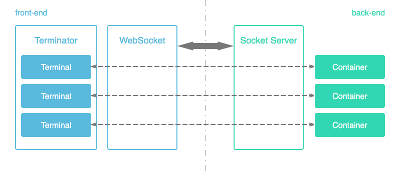
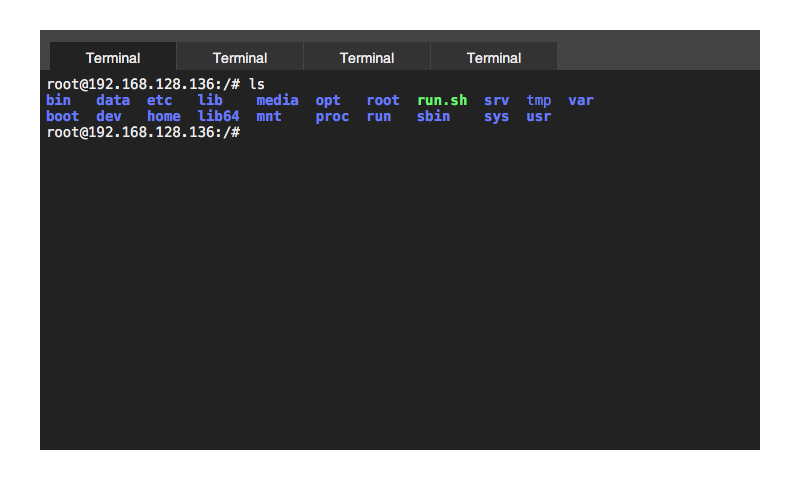
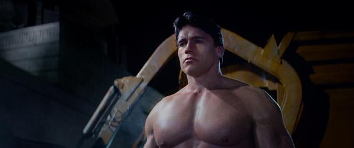
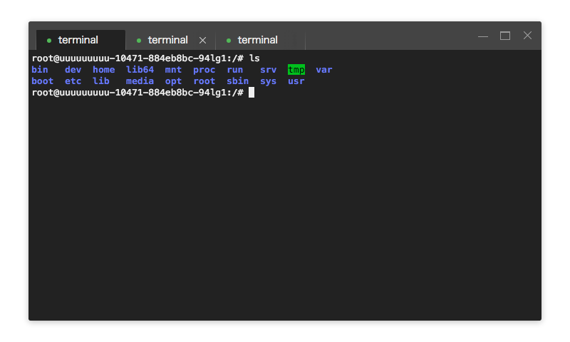

评审完交互稿的时候，我才意识到这玩意儿的复杂性，还是咽了口唾沫：“有点悬啊——”想想这时离提测只剩一个星期了。飘兄在旁边鼓励说：“雨森，没问题的。”

飘兄是[网易蜂巢](https://c.163.com)的技术负责人。两个月前，他和其他老大们制定出这个需求：蜂巢要出一个很强大的组件，在Web端就可以直接SSH到容器上，并且可以执行各种命令操作，但这不是重点，这部分已经实现了。接下来要做的工作是在Web端可以同时SSH到多个容器上，这就需要组件支持：单窗口，可拖拽，多Tab，可排序，最大化，最小化，可缩放，自适应……差不多就是这些，另外还有许多未来的需求。总之就是要把咱们程序猿平时在类Unix系统中最喜爱的Terminal搬到Web里，即WebTerminal。

当时这个任务安排给我的时候，我觉得很有挑战性，良辰最喜欢对那些能力出众的组件出手了。

好的开始是成功的一半，那就先想个名字吧。Terminal，Console，WebTerminal，WebConsole，……(>﹏<)，这些名字都太平凡了，辣么强大的组件当然得有个霸气的名字。霸气，考虑到前段时间电影《终结者》很火很霸气，英文又和终端的比较像，那就叫Terminator好了。

于是，回家先补了一部《终结者》。

然后考虑技术选型。对于这种有很多复杂交互的组件，还是用我易海波大神出的[基于动态模板的数据驱动型的RegularJS](http://regularjs.github.io/guide/zh/index.html)比较合适，再加上我写的[基于RegularJS的组件库Regular UI](http://regular-ui.github.io/index.html)也可以配套使用，这样就事半功倍了。强调一遍，这不是在打广告，这不是在打广告！

接下来先回顾了一下以前的代码，而后理了理整个前后端流程，大概是酱紫的：

一个Terminator组件包括多个Terminal对象，每个Terminal对象负责处理一个SSH连接。前端通过WebSocket与后端通信，后端先经过Socket Server中转，然后再连接到具体的容器。

到目前为止，右边的后端已经完成，中间的前后端通信也已调通，剩下的工作就是最左边的Terminator组件的前端实现。

有了前面的准备工作就可以开始Coding了。先快速给组件搭了个架子，建好相应文件，组织代码结构，写个简单样式，再加个测试demo。把能塞的东西先塞进去，至少可以开始装逼。然后就达到了如下的效果：

一个简单的Terminator出来了，却很简陋。窗口有了但不能移动和缩放，Tab可以切换但不能排序，SSH可以连接但不知道状态，离目标还很远。

俗话说，打蛇要打七寸。目测一下，还剩这么多复杂的交互需求，最核心要解决的不是Tab排序，也不是窗口缩放，而是拖拽功能。因为Tab排序和窗口缩放都是要依赖拖拽功能的。一般来说，Web前端工程师提到拖拽就会谈(fei)虎(chang)色(dan)变(teng)，一是因为拖拽不是前端的一个常用交互，很多工程师没这方面开发经验；二是因为拖拽本身就是一种复杂的鼠标事件封装，虽然前端领域关于拖拽方面的库挺多的，但也基本不能直接拿过来用。总之就是，我需要开个副本打一套拖拽装备，才能继续练级打终结者这个大Boss。

关于研究拖拽的心理历程，又可以写一篇文章了，我在这里简述一下踩过的坑：
1. 最开始打算用HTML5的拖拽API，后来发现兼容性不好，而且也不是很灵活。最终还是选择用`mousedown`、`mousemove`、`mouseup`三个鼠标事件进行封装。
2. 关于用组件还是用指令实现，我也都试过，最后还是发现作为组件时的拖拽功能更强大一些。

就这样，研究了一个月，[Draggable](http://regular-ui.github.io/jsmodule/draggable.html)和[Droppable](http://regular-ui.github.io/jsmodule/droppable.html)这一对双胞胎诞生了。

这时候Terminator组件大概完成了50%，由于交互稿和视觉稿还没确定，再加上有其他的任务，我便只能开发到这一步。之后的一段时间里，调研了一下像Tab排序、窗口缩放等后续的技术难点，修复了一些如内容排版错乱、复制粘贴兼容性等麻烦的小bug。

直到一个星期前，评审完交互稿的时候，我就懵逼了。怎么突然多了个Dropdown？我擦，Tab还要隐藏？那啥，还有气泡提示？……我了个去，还能不能愉快地写代码了。。。而且现在离提测只剩一个星期了，我还有其他两个任务没结束，话说视觉稿还没出来……

散会后，起初有点小紧张，搞杯咖啡缓一缓。。想想哥本科当年，考前4小时突击概率论，2天热战统计物理，3天拿下量子力学，那也是身经百战，见得多了，这还有一个星期，应该不算问题。不胡思乱想了，抓紧时间写代码才是王道。

现在交互增加了些东西，就应该重新理一理组件的各种关系。经过思考和分析，它们最后是这样的：

1. Terminator包含Terminal和TabWindow两个组件。Terminal处理单个SSH连接，TabWindow实现多Tab窗口功能。
2. TabWindow继承自Window，包含[Tabs](http://regular-ui.github.io/jsmodule/tabs.html)、[Dropdown](http://regular-ui.github.io/jsunit/dropdown.html)和[Draggable](http://regular-ui.github.io/jsmodule/draggable.html)三个组件。Window实现单窗口功能，Tabs实现多Tab功能，Dropdown解决Tabs的溢出问题，Draggable处理Tabs的排序问题。
3. Window包含Resizable和Draggable，Resizable实现可缩放的功能，Draggable处理Window可移动的功能。
4. Resizable的核心是Draggable，因为Resizable本来就要拖拽的。

接下来的几天里，就是对这些组件各个击破：

1. Draggable之前已经实现。
2. Resizable就是个绝对定位的`div`容器，8个拖拽句柄分别用8个Draggable组件来实现，然后就是在拖拽事件中处理容器的大小和位置。
3. Window的窗体只需套一个上面的Resizable便可以缩放。移动功能使用Draggable也可以轻松实现，将Window的标题栏设置为拖拽句柄，Window的窗体设置为拖拽代理即可。再加上最大化和最小化这些小功能。
4. TabWindow是块硬骨头，这里要处理Tabs的排序和Tabs的溢出两大问题。
5. Tabs的排序有些难度，需要根据当前拖动的位置实时计算出要不要交换、和哪个交换。我先计算出拖起来Tab的水平中点位置，然后再和其它项的位置比较，实现出来后效果不错。这里参考了Chrome和Firefox的Tab排序的顺滑体验。

6. 关于Tabs的溢出，刚开始的思路是删掉Tabs溢出后的节点，Dropdown再依次添加，后来发现这样需要维护两处数据，并且有许多小情况要考虑，于是放弃了这种方法。后来想到一种贱贱的方法，Tabs和Dropdown共用一处数据，Tabs只需隐藏溢出的节点，Dropdown只需隐藏Tabs没溢出的节点，这样简化了很多逻辑。
另外还遇到一个问题，当窗口大小调整时，需要实时判断Tabs的溢出数量。但是如果已经存在隐藏的Tab，由于它们宽度为0，便无法计算正确的总宽度。这里曾卡住一段时间，后来我又想到了一种贱贱的方法，复制一份同样的Tabs，不处理其他逻辑，只用来测量宽度，然后把它悄悄地悬浮起来，`top: -1000px`。机智的我已经看穿了一切！

7. 还有一些收尾工作，之前已经将Terminal和TabWindow组合起来了，再融入新鲜出炉的视觉样式，最后加上气泡提示、连接信号和退出弹窗等小功能。

最终，Terminator就这样诞生了，当然之后发现一些bug是肯定的。效果图如下：

错了，应该是这张：

提测了之后，就可以稍微松一口气。先去部门年会High去了。
