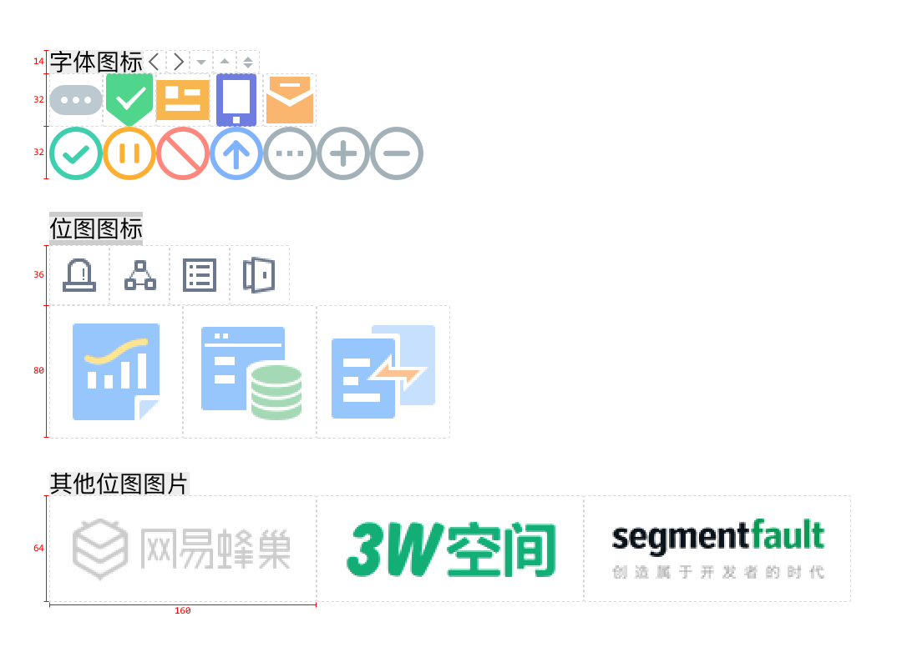

### 模块化

- JS模块化

前者用于服务器，后者用于浏览器。
再加上ES6本身语言精简规范，是未来发展的必然趋势，因此在前端架构中使用是毋庸置疑。

- CSS模块化

<!--  -->

## 组件化

> ??包??

（本文认为仅有HTML+CSS的结构单元也是一种组件，称为CSS组件）

从理论上，我比较认同Vue的component.vue这种单文件结构，但从实践上，我认为一个目录作为组件功能性和扩展性更强一些。

<!-- 三位一体 -->

## 规范化
> 一个项目中只应该有一套规范

在前端工程中制定良好的规范对把控项目质量是十分重要的。

<!-- ，不能及时响应需求变更 -->

再加上前端语言的灵活性和前端开发者的多元性本身会对项目造成很多不确定因素，

        node_modules/
            rgui-ui-base/       # Regular UI组件包
            rgui-ui-listview/   # Regular UI组件包
            rgui-ui-modal/      # ...
            rgui-ui-overlay/    # ...
            rgui-ui-select/     # ...
            ...

<!-- ??设计良好的开发规范应该以实用性为前提，可以提升开发效率，降低维护成本。?? -->
<!-- ??严的规范，给予开发者适当灵活性?? -->
<!-- 强规范，弱灵活 -->

<!-- 不建议直接使用eslint-config-airbnb，一是Airbnb的配置风格不一定完全。因此我们采取自行配置。 -->
<!-- 虽然初期研究ESLint的时间成本较高，并且刚配置后的程序员会有些不适，但从长远看，肯定是利大于弊的。 -->

<!-- 任何简单重复劳动都应该让机器去处理。 -->

为了更加高效，我们和视觉设计师进行了沟通，对图标也作了相应的规范：

1. 单色图标做成svg，正方形，尺寸为4的倍数，最小画布为14x14，推荐画布16x16、24x24、32x32；
2. 多色图标做成png，正方形，尺寸为10的倍数，最小画布为20x20；
3. 其它图片按使用场景，尽量不要贴边切，尺寸为4的倍数。

