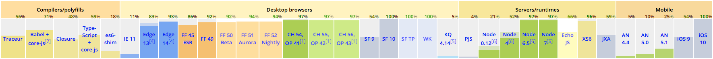
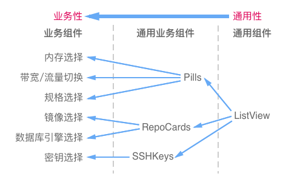
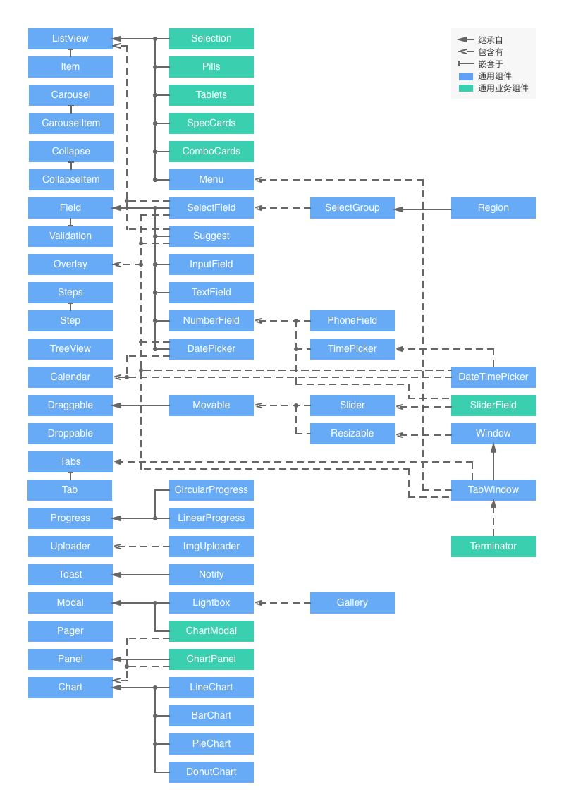
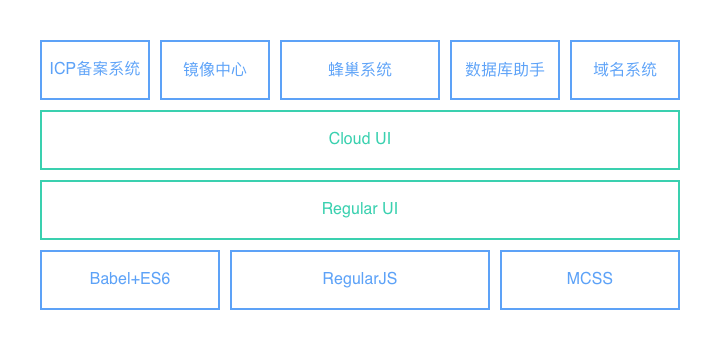
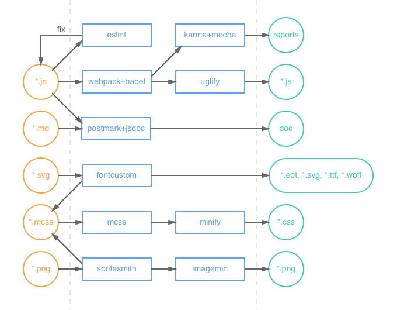

<style>
author { display: block; font-size: 12px; color: #555; }
.u-imgtitle { font-size: 12px; font-weight: bold; text-align: center; }
</style>
<author>云计算平台产品部-前端组 赵雨森</author>

近两年前端领域风云变幻，各种技术栈层出不穷。React、Angular2、Vue2逐步三分天下，Webpack + Babel + ES6模式如日中天，PostCSS大有取代SASS、LESS、Stylus的趋势，还有http2、WebComponents、WebAssembly、函数式编程等新概念不断涌现。让我们这些前端工程师应接不暇、感叹不已：“今年一个技术还没学会，明年可能就不用学了。”

回顾前端发展历史，按照[@xufei](https://www.zhihu.com/people/sharpmaster)[《前端开发技术的发展》](https://github.com/xufei/blog/blob/master/posts/2013-01-14-%E5%89%8D%E7%AB%AF%E5%BC%80%E5%8F%91%E6%8A%80%E6%9C%AF%E7%9A%84%E5%8F%91%E5%B1%95.md)一文中的观点，大概可以分为三个阶段：

- 刀耕火种：典型特征是服务器语言（ASP、JSP、PHP）为主，结合简单的CSS和JS代码片段。是最早期的WebPage模式；
- 手工工场：典型特征是Ajax的出现，它使得WebApp模式成为可能。这期间jQuery、Prototype和Mootools几个库占主导地位，并出现了初步的模块加载方式；
- 工业革命：典型特征是各种MV*框架的不断出现，各种开发模式的不断演进，各种自动化工具的不断革新，各种标准的不断确立。

2015年ES6标准的确立标志着前端领域正式进入了蒸汽时代。但离流水线作业的电气时代还有一段路要走。

相对于去年剧烈的变革，今年的前端生态有所缓和。乘着工业化浪潮，我们[网易蜂巢产品（以下简称蜂巢）](https://c.163.com)前端组本着面向未来、稳步推进的原则，也对项目架构进行了优化改进，并确立了新的发展方向。

本文以蜂巢产品下的蜂巢系统、镜像中心、数据库助手、ICP备案系统和域名系统五个单页系统（SPA）为例，阐述我们组工业化前端架构的整体思路。

本文认为关于前端架构的工业化，主要应该从模块化、组件化、规范化和自动化四大方面考虑，下面一一展开。

## 模块化

> 分工产生效能。

模块化是“刀耕火种”和“手工工场”的分界线。它的作用是**将一个大文件拆分成相互依赖的小文件，再进行统一的拼装和加载**，这为多人协作提供了可能。

### JS的模块化

在ES6之前，JavaScript一直没有模块系统，这对开发大型复杂的前端工程造成了巨大的障碍。

对此社区制定了一些模块加载方案，如CommonJS、AMD和CMD等，某些框架也会有自己模块系统，如Angular1、我们公司的NEJ等。总之一个比一个实现得丑，最后甚至还发展出了为了兼容几种规范的变态级UMD：

```javascript
(function (root, factory) {
    if (typeof exports === 'object')
        module.exports = factory();
    else if (typeof define === 'function' && define.amd)
        define(factory);
    else
        root[library] = factory();
})(this, function () {
    //module ...
});
```

幸运的是，现在ES6已经在语言层面上，规定了模块系统，而且使用起来相当方便，完全可以取代现有的CommonJS和AMD规范。

当然在2016年选择ES6不算尝鲜，各种生态已经相当成熟（如下图），唯一要考虑的因素就是兼容性要求。



<div class="u-imgtitle">图1 截止至2016年11月，各厂浏览器对ES6的支持率（现代浏览器和Node.js稳定版均达到90%以上）</div>

如果你想使用Babel：
- IE6、7就不用考虑了（貌似我们公司有项目还在支持）；
- IE8在项目中不能使用`export * from 'xxx'`这个功能，但你不能保证使用的依赖库中没有用到，具体请参考[使你的 React 应用兼容 IE8](https://github.com/xcatliu/react-ie8)；
- IE9+只需吃个`babel-polyfill`就能完美使用。

我们的蜂巢是技术型产品，只要兼容到IE9+即可，所以上ES6毫无压力。至于打包工具，目前来说最好的非Webpack莫属。因此，

*技术选型：Webpack + Babel + ES6*

### CSS的模块化

虽然SASS、LESS、Stylus等预处理器实现了CSS的文件拆分，但没有解决CSS模块化的核心问题：选择器的私有化问题（全局污染问题）。

按道理，一个模块化的文件应该要隐藏内部作用域，只暴露少量接口给使用者。而按照目前预处理器的方式，导入一个CSS模块后，已存在的样式有被覆盖的风险。虽然重写样式是CSS的一个优势，但这并不利于多人协作。

为了避免全局选择器的冲突，各厂都制定了自己的CSS命名风格：
- BEM风格；
- Bootstrap风格；
- Semantic UI风格；
- 我们公司的[NEC风格](http://nec.netease.com/standard)；
- ...

但这毕竟是弱约束。选择器随着项目的增长变得越多越复杂，然后项目组里再来个新人带入自己的风格，就更加混乱了。

所以我很赞同知乎上一个人的观点：

> 与其费尽心思地告诉别人要遵守某种规则，以规避某种痛苦，倒不如从工具层面就消灭这种痛苦。

从工具层面，社区又创造出Shadow DOM、CSS in JS和CSS Modules三种解决方案。

- Shadow DOM是WebComponents的标准。它能解决全局污染问题，但也使样式彻底私有化了，造成外部无法重写，损失了灵活性；
- CSS in JS是彻底抛弃CSS，使用JS或JSON来写样式。这种方法很激进，不能利用现有的CSS技术，而且处理伪类等问题比较困难；
- CSS Modules仍然使用CSS，只是让JS来管理依赖。它能够最大化地结合CSS生态和JS模块化能力，目前来看是最好的解决方案。

目前蜂巢产品中使用的是我们公司[@郑海波](https://www.zhihu.com/people/leeluolee)写的[MCSS](https://github.com/leeluolee/mcss)，一个比SASS好用的预处理器。

考虑到从预处理器迁移为CSS Modules的成本较高，这块内容暂时不做调整。不过有意向在新的项目中实践PostCSS + CSS Modules。

*技术选型：MCSS*

## 组件化

> 现代化生产的分工协作要求工业部件遵循互换性原则。

当前最火的React带头掀起了组件化浪潮，随后Vue、Polymer、Angular2等各种组件化框架/类库如雨后春笋般出现，我们公司[@郑海波](https://www.zhihu.com/people/leeluolee)写的[RegularJS](https://github.com/regularjs/regular)也是组件化框架的一面旗帜。

那么，究竟什么是组件化？

### 组件化的概念

首先，组件化≠模块化。好多人对这两个概念有些混淆。

模块化只是在语言层面上，对代码的拆分；而组件化是基于模块化，在设计层面上，对UI（用户界面）的拆分。

从UI拆分下来的**每个包含模板(HTML)+样式(CSS)+逻辑(JS)功能完备的结构单元，我们称之为组件。**

组件化除了要处理组件这种本身的封装，还要处理组件之间的逻辑(JS)继承，样式(CSS)扩展和模板(HTML)嵌套等关系。

因此，组件化实际上是一种按照模板(HTML)+样式(CSS)+逻辑(JS)三位一体的形式对面向对象的进一步抽象。

然后，我们再思考一个问题：为什么类React框架/类库是组件化的，而之前的框架/类库，如jQuery、Angular1等也有很多配套的组件，就不是组件化的呢？

React提倡的理念能给出答案：

> Keep Simple. Everything can be a component.

这句话就是说页面上所有的东西都是组件。页面是个大型组件，可以拆成若干个中型组件，然后中型组件还可以再拆，拆成若干个小型组件，小型组件也可以再拆，直到拆成DOM元素为止。DOM元素可以看成是浏览器自身的组件，作为组件的基本单元。

这其实是一种分治（分而治之）思想。

传统前端框架/类库的思想是先组织DOM，然后把某些可复用的逻辑封装成组件来操作DOM，是DOM优先；而组件化框架/类库的思想是先按顶层设计来构思组件，然后用DOM这种基本单元结合相应逻辑来实现组件，是组件优先。这是两者本质的区别。

再看看客户端框架，像WinForm、WPF、Android等，它们从诞生的那天起就是组件化的。当年写客户端的日子比较舒服，就是因为没有类似DOM这样的繁琐操作。而前端领域发展曲折，传统框架只是面向WebPage的，随着Web业务日益复杂化和多元化，面向WebPage逐渐转成面向WebApp，传统框架已经不能很好的解决问题了，因此才从客户端框架经验中引入了组件化思想。

综上，**组件化是一种在设计层面上，对项目中UI进行整体的疏理和拆解，再按照HTML+CSS+JS三位一体的面向对象来进行封装的过程或思想**。

按照组件化思想，我们改变了原来按照HTML、CSS、JS文件分开管理的策略，采取**一个组件一个目录**的原则。单个组件目录结构如下：

```
component/
    demo/
        index.md    # 组件文档
    test/
        spec.js     # 单元测试
    index.mcss      # 组件样式
    index.js        # 组件逻辑
    index.rgl       # 组件模板
    index.json      # 组件信息
```

从理念上，我很认同Vue的`*.vue`这种单文件结构；但在实践上，我认为用一个目录来表示组件，功能性和扩展性会更强一些（比如要增加单元测试和组件文档等功能），而且多文件在编辑器中分栏编辑更加方便。

### 组件的分类

按照组件的代码组成，组件可以分为：HTML、HTML+CSS、JS、HTML+JS、HTML+CSS+JS。

本文认为缺失JS的结构单元也是组件，比如仅有HTML+CSS的结构单元称为CSS组件。

按照组件的**通用性（复用性）**，组件可以分为以下三类：

- 通用组件：不同产品间可以复用的组件。比如[ListView](https://github.com/regular-ui/ui-listview)，既可以在蜂巢中使用，也可以在别的产品中使用；
- 通用业务组件：仅在同一产品中可以复用的组件。比如按照蜂巢视觉，对ListView进行了样式扩展的RepoCards，可以在蜂巢中多处使用，且能进一步扩展，但只能在蜂巢中使用；
- 业务组件：不可以复用的组件。比如具体场景中使用的组件，一次性的业务模块等。

<p class="f-tac"></p>
<div class="u-imgtitle">图2 蜂巢组件通用性示例</div>

本文认为组件的一个设计原则是：**在不增加组件配置复杂度的情况下，尽可能的提高组件通用性。**

<!-- 提高开发效率，减少维护成本 -->

### 组件之间的关系

前面提到组件之间的关系有**继承**、**扩展**和**嵌套**，还有一种关系是**包含**，表示一个组件内部调用了另一个组件。这些关系都可以归属为**依赖**。

下面这张图展示了蜂巢的一部分组件和它们之间的依赖关系：

<p class="f-tac"></p>
<div class="u-imgtitle">图3 蜂巢组件（部分）依赖关系图</div>

### 组件库

**组件库是一系列组件的集合。**

因为本土优势，蜂巢的组件化框架使用了我们公司的[RegularJS](https://github.com/regularjs/regular)；通用组件库使用了我写的[Regular UI](http://regular-ui.github.io/index.html)。

根据交互和视觉规范，蜂巢产品下的五个单页系统的组件风格是统一的，因此它们之间有很多通用业务组件可以共享。为了减少维护成本，我们在Regular UI的基础上，加上蜂巢的视觉样式和一些新的通用业务组件（图3中绿色的组件），再封装成一套专为云计算使用的Cloud UI组件库。

最后，蜂巢的组件化架构如下：

<p class="f-tac"></p>
<div class="u-imgtitle">图4 蜂巢组件化架构</div>

*技术选型：RegularJS + Regular UI + Cloud UI*

## 规范化

> 现代工厂制度是工业革命发展的必然产物。

模块化和组件化确定了开发模型，而这些东西的实现需要规范去落实。

在以前没有规范的日子里，我们的项目中一度出现过以下问题：
- 各模块代码风格不一致。一个程序员接手另一个程序员的模块后要预热、理解甚至重构；
- 各模块对外接口不一致。比如有的模块输出对象、有的模块输出构造器，导致使用起来很混乱；
- 容易产生重复功能的模块和组件。比如有段时间蜂巢项目中同时存在4个相同功能的自定义Select组件的情形；
- ...

这些问题的存在，已经降低了模块化和组件化的实用性。会大大影响开发效率，增加维护成本，进而会影响网页性能，产生隐藏的bug。

因此，我们也对团队的开发方式和开发流程进行了规范化改进。

### 目录结构

上文中提到，按照组件化思想，我们对项目的目录结构进行了重新的梳理。现在目录结构如下：

```
src/                # 源文件
    base/           # 基础类库
    common/         # 通用组件和通用业务组件
    specific/       # 业务组件
    module/         # 模块组件
    page/           # 页面及入口css和js
    service/        # 数据服务
    icons/          # 图标源文件
        png/        # 雪碧图标源文件
        svg/        # 字体图标源文件
    assets/         # 静态文件
dest/               # 生成文件
    css/
    js/
    img/
    fonts/          # 图标字体和专用字体
    vendor/         # 第三方库
node_modules/
    cloud-ui/       # Cloud UI组件库
package.json
.gitignore
.eslintrc           # eslint配置
...
```

源文件和目标文件完全分开，依赖统一用npm进行包管理。

`common`、`specific`和`module`三个目录存放组件：
- `common`存放通用组件和通用业务组件（大部分移入了Cloud UI）；
- `specific`存放普通业务组件；
- `module`存放业务模块组件。

### 编码规范

对项目中的各种语言，我们参考了Airbnb、Google等市面上比较通用的代码规范，再结合自己的代码特点，制定了相应的规范：

- [命名规范](http://regular-ui.github.io/start/rule.html#命名规范)
- [CSS/MCSS编码规范](http://regular-ui.github.io/start/rule.html#CSS规范)
- [JaveScript编码规范](http://regular-ui.github.io/start/rule.html#JS规范)
- [Regular组件设计规范](http://regular-ui.github.io/start/rule.html#Regular规范)

### Lint

以前的编码规范仅是口头约束+书面文档+CodeReview，约束力不强。今年引入了ESLint进行强制性约束。

我们的配置策略如下：
1. 花一天时间先遍历ESLint的437条规则；
2. 筛选需要的规则，并在组内讨论；
3. 先将确定的规则全部配error，然后再根据情况降级（因为往往配了warning，大家就不太care了）；
4. lint存在error时禁止提交代码。

虽然初期配置ESLint的时间成本较高，但从长远看，ESLint能大大提高代码质量，提升协作效率。所以之后打算给CSS也配上Lint。

*技术选型：ESLint*

## 自动化

> 现代工业其所以区别于工场手工业，是由于机器起了主要的作用。

自动化是“手工工场”和“工业革命”的分水岭。（仅作比喻，与历史无关）

### 图标合并

以前在蜂巢项目中，雪碧图是用PS手动拼的，字体图标是用icomoon手动生成的，然后再将导出的文件手动拷到项目中的。这是典型的手工工场生产方式。

这种方式存在以下问题：
- PS和icomoon谁管理比较好，前端还是视觉？
- 想知道图标对应哪个className，每次都要在源码中找一遍；
- 多人同时编辑二进制文件，会产生git冲突；
- 产品迭代迅速，遗留许多旧图标不敢删除。

如今在项目中引入了SpriteSmith和FontCustom两个Gulp插件，让图标能够自动合并，解决了以上所有问题，步入了工业化生产。

视觉只需提供svg和png图标源文件，前端按照想要的className命名，放入`icons`目录中即可使用。其实这也相当于是图片资源的模块化。

*技术选型：SpriteSmith + FontCustom*

### 可视化组件文档

前端开发和后端开发不同的是，前端开发是可视化的。

后端文档只要写个markdown文件，放在git仓库就能阅读；而在前端文档中，你写个`m-modal-lg`，别的开发者根本不知道你这个模态框多大，是个什么样子，去翻源码也无法感知组件的具体使用场景。

因此在前端工程中书写可视化的组件文档，也是很有必要的。

但这种高科技文档必然要插入CSS和JS，如果手工写肯定工作量很大，一是在迅速的产品迭代中来不及，二是会降低大家写文档的积极性。

对此，我们做了两项工作：

1. 写了一个PostMark插件，在markdown的基础上，将代码块中的Regular组件示例代码同步转换成JavaScript代码，使组件能够在最终的文档中活灵活现；
2. 将组件JS文件中JSDoc风格的注释提取出来，转换成文档的API部分，插入到文档最后。

剩下的书写工作就很简单：前端工程师只要在每个组件的`demo`文件夹中创建md文件，并书写文档内容和组件示例，在组件JS文件中书写API，就能自动生成相应文档。生成效果类似[Regular UI文档](http://regular-ui.github.io/jsunit/dropdown.html)。

*技术选型：PostMark + JSDoc*

### 前端自动化测试

前端自动化测试能够保证代码质量、减少人肉测试、提高团队开发水平，这些优点是不言而喻的。

但它配置比较复杂，UI测试成本很高，很多团队对其望而却步。

由于产品迭代迅速，我们遵循**维护自动化测试成本最低**原则，在项目中只覆盖：
- 基础类库的单元测试；
- 通用组件和通用业务组件的单元测试；
- 通用组件和通用业务组件简单的UI测试。

由于RegularJS的MVVM特性，大部分组件的UI测试可以省略，因此这部分工作主要以给Regular UI和Cloud UI两个组件库加单元测试为主。

市面上前端测试框架有很多，选择哪个都不会有太大问题，最重要的是你要开始做，QA一定很开心。

*技术选型：Karma + Mocha + Expect.js*

### 构建工具

以上几点都是单项工作的自动化，要让它们相互衔接，实现整套工作的自动化，还需要一套完整的构建体系。

目前Gulp是处理工作流的最佳选择。

*技术选型：Gulp*

由于蜂巢产品下有多个系统，如果每个系统都搭一套gulp+webpack+babel+...，就不能保证几个平台的统一性，而且维护起来成本较高，是得不偿失的。因此实现一套独立于项目的构建工具是最好的解决方案。

我把本文中描述的这种工业化前端架构称为[Pursuit架构](https://github.com/rainfore/pursuit)，PURSUIT是多个技术栈单词的合并：webPack + gUlp + Regular + mcsS + rgUI + eslinT，中文意思是追求，意味着不断追求前端技术、紧跟时代发展潮流。

然后按照这套架构实现了对应的构建工具[pursuit-cli](https://github.com/rainfore/pursuit-cli)，目前已在蜂巢产品下的各个系统中使用。

最后，整套Pursuit架构的工作流程如下：

<p class="f-tac"></p>
<div class="u-imgtitle">图5 工作流程图</div>

- 使用gulp作为基本工作流；
- 使用webpack+babel编译打包，再用uglify压缩js；
- 使用mcss预处理css，再用minify压缩css；
- 使用spritesmith生成雪碧图，再用imagemin压缩png；
- 使用fontcustom生成字体图标；
- 使用eslint规范编码格式，并自动fix；
- 使用karma+mocha进行自动化测试，并输出测试报告；
- 使用postmark+jsdoc生成可视化组件文档。

开发者能很方便地上手自动化工具，基本无需感知内部操作。在开发阶段只要运行`pursuit dev`，就可以在实时监听文件的情况下，执行**构建项目+生成文档+验证代码风格**等任务。在发布阶段只要运行`pursuit online`，就可以按照**清理文件->生成图标->构建项目->运行测试->验证代码风格**这样的任务流程一键部署。

## 其他

至于性能优化、数据统计、安全漏洞等其他前端架构问题，解决完本文中提到的四大方面问题之后可以很好处理。且与前工业化架构的解决方法相同，这次蜂巢架构没有做相关调整，因此本文不再介绍。
