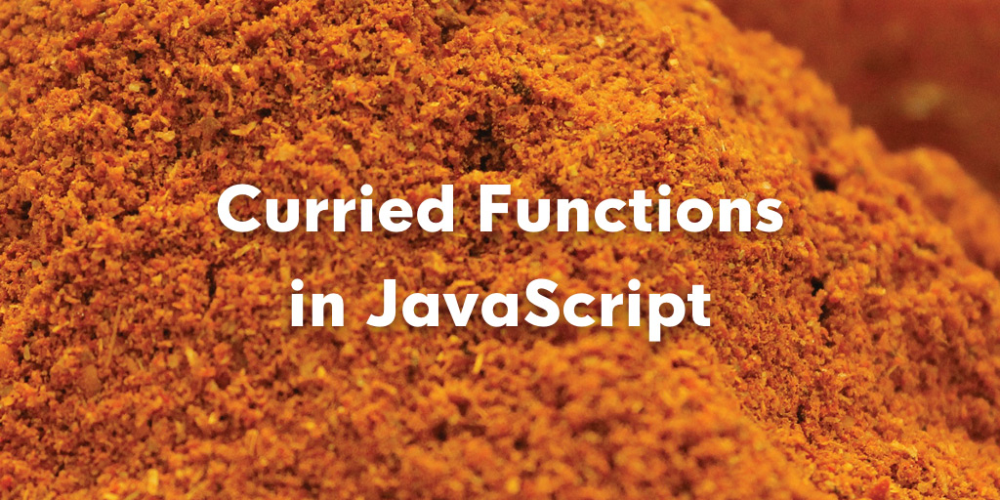

## 什么是柯里化？

柯里化来源于数学家Haskell Curry的名字（编程语言Haskell也是以他的名字命名的）。

> **柯里化（Curry），又称部分求值（Partial Evaluation）**。其含义是给函数分步传递参数，每次传递参数后部分应用参数，并返回一个更具体的函数接受剩下的参数，这中间可嵌套多层这样的接受部分参数函数，直至返回最后结果。

### 典型示例

下面是一个部分求和的例子：

``` javascript
const curry = (func) => {
    const args = [];
    return function result(...rest) {
        if (rest.length === 0)
            return func(...args);

        args.push(...rest);
        return result;
    }
}

const add = (...args) => args.reduce((a, b) => a + b);

const sum = curry(add);

sum(1,2)(3);
sum(4);
sum(); // 10
```

## 柯里化的基础

上面的`curry`函数是一个高阶函数（high-order function）。高阶函数是指操作函数的函数，它接收一个或者多个函数作为参数，并返回一个新函数。此外，还依赖于闭包的特性，用来保存中间过程中输入的参数。即柯里化的基础：

- 函数可以作为参数传递
- 函数能够作为函数的返回值
- 闭包

## 柯里化的应用
### 1. 延迟计算

上面的例子已经很好地说明这一点了。

### 2. 动态创建函数

例如兼容现代浏览器和IE浏览器的添加事件方法，我们通常会这样写：

``` javascript
const addEvent = (elem, type, fn, cature) => {
    if (window.addEventListener) {
        elem.addEventListener(type, (e) => fn.call(elem, e), capture);
    } else if (window.attachEvent) {
        elem.attachEvent('on' + type, (e) => fn.call(elem, e);
    }
}
```

这种方法显然有个问题，就是每次添加事件处理都要执行一遍`if {...} else if {...}`。其实用下面的方法只需判断一次即可：

``` javascript
const addEvent = (() => {
    if (window.addEventListener) {
        return (elem, type, fn, capture) => {
            elem.addEventListener(type, (e) => fn.call(elem, e), capture);
        };
    } else {
        return (elem, type, fn, capture) => {
            elem.attachEvent('on' + type, (e) => fn.call(elem, e);
        };
    }
})();
```

这个例子，第一次`if {...} else if {...}`判断之后，完成了部分计算，动态创建新的函数来处理后面传入的参数，以后就不必重新进行计算了。这是一个典型的柯里化应用。

### 3. 参数复用

当多次调用同一个函数，并且传递的参数绝大多数是相同的时候，那么该函数就是一个很好的柯里化候选。

例如我们经常会用`Function.prototype.bind`方法来解决上述问题。

``` javascript
const obj = { name: 'test' };
const foo = function (prefix, suffix) {
    console.log(prefix + this.name + suffix);
}.bind(obj, 'curry-');

foo('-function'); // curry-test-function
```

与`call`/`apply`方法直接执行不同，`bind`方法将第一个参数设置为函数执行的上下文，其他参数依次传递给调用方法（函数的主体本身不执行，可以看成是延迟执行），并动态创建返回一个新的函数。这很符合柯里化的特征。下面来手动实现一下`bind`方法：

``` javascript
Function.prototype.bind = function (...args) {
    return (...rest) => this.call(...args, ...rest);
};
```

## 什么是反柯里化？

上面讲了柯里化，我们知道它的主要特点是逐步传参，逐步缩小函数的适用范围。反过来，反柯里化的作用就是扩大函数的适用范围，使本来作为特定对象所拥有的功能的函数可以被任意对象所用。

即把如下给定的函数调用形式：

``` javascript
obj.func(arg1, arg2);
```

转化成如下的函数调用形式：

``` javascript
func(obj, arg1, arg2);
```

这就是反柯里化的形式化描述。

当然这里有个前提，就是函数`func`需要语言上支持[鸭子类型](https://zh.wikipedia.org/wiki/%E9%B8%AD%E5%AD%90%E7%B1%BB%E5%9E%8B)。

### 1. 最简形式

用箭头函数可以很简单地实现反柯里化：

``` javascript
const uncurry = (func) => (...args) => func.call(...args);

const split = uncurry(String.prototype.split);
split('a,b,c', ','); // ['a', 'b', 'c']
```

### 2. 进击的形式

可以看出，`uncurry`函数和上面的`bind`方法有点神似。下面的形式可以表示出它们与`call`方法之间的关系。

``` javascript
const uncurry = (func) => Function.prototype.call.bind(func);
```

### 3. 终极形式

利用`bind`方法可以再剥掉一层，得出反柯里化的终极形式：

``` javascript
const uncurry = Function.prototype.bind.bind(Function.prototype.call);
```

最后以一个反柯里化的`bind`函数的终极形式结束，其实就是代入上上个式子得出的结果。

``` javascript
const bind = Function.prototype.call.bind(Function.prototype.bind);
```

可见柯里化与反柯里化演绎出了各种JavaScript的奇技淫巧。

------

###### 参考

- [浅析 JavaScript 中的 函数 currying 柯里化](http://www.cnblogs.com/zztt/p/4142891.html)
- [浅析 JavaScript 中的 函数 uncurrying 反柯里化](http://www.cnblogs.com/zztt/p/4152147.html)
- [JS中的柯里化(currying)](http://www.zhangxinxu.com/wordpress/2013/02/js-currying/)
